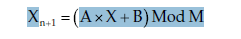

# Numerical Algorithms

Numerical algorithms calculate numbers. The perform such tasks as radomizing values, breaking numbers into their peime factors, finding greatest common divisors and computing geometric areas.

## Randmozing Data

Randomization plays an important role in many applications. It lets a program simulate random processes, test algorithms to see how many behave with random inputs and search for solutions to difficult problems

### Generating Random Values

Most application use _pseudorandom number generator_(PRNG)
One simple and common method of creating pseudorandom numbers is a linear congruinetial generator, which uses the following relationship to generate numbers:

Usually programs need to use a fair PRNG. A fair PRNG is one that produces all of its possible outputs with the same probability. A PRNG that is unfair is called a biased PRNG

### Randomizing Arrays